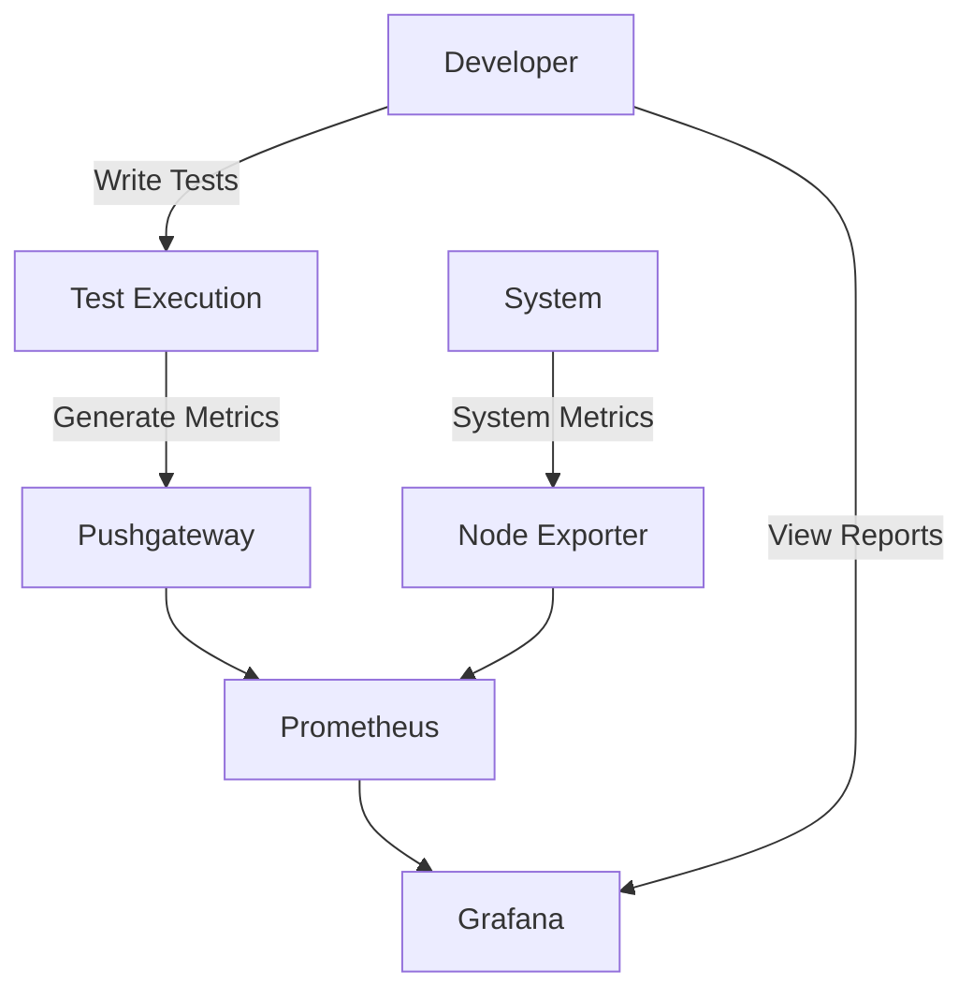

# ParaBank UI Automation - Complete Guide

## 📖 Table of Contents
1. [Project Overview](#-project-overview)
2. [Project Structure](#-project-structure)
3. [Prerequisites](#-prerequisites)
4. [Setup & Installation](#-setup--installation)
5. [Development Workflow](#-development-workflow)
6. [Testing](#-testing)
7. [Monitoring & Reporting](#-monitoring--reporting)
8. [CI/CD Integration](#-cicd-integration)
9. [Code Quality](#-code-quality)
10. [Troubleshooting](#-troubleshooting)

## 🏗️ Project Overview

ParaBank UI Automation is a robust testing framework designed for automated UI testing of the ParaBank application. It leverages modern tools and best practices to ensure reliable and maintainable test automation.

## 🏛️ Project Architecture

### Core Components

1. **Test Framework**
   - Built on **Playwright** for cross-browser testing
   - Uses **Pytest** as the test runner
   - Implements **Page Object Model (POM)** for maintainable test code

2. **Monitoring Stack**
   - **Prometheus**: Metrics collection and storage
   - **Grafana**: Visualization and dashboards
   - **Pushgateway**: Temporary metrics storage for batch jobs
   - **Node Exporter**: System metrics collection

3. **CI/CD Pipeline**
   - GitHub Actions for automated testing
   - Automated reporting and notifications
   - Containerized test execution

### Data Flow



### Key Design Patterns

1. **Page Object Model (POM)**
   - Each page has its own class
   - Encapsulates page elements and actions
   - Improves test maintainability

2. **Factory Pattern**
   - Used for browser instantiation
   - Supports multiple browser types

3. **Singleton Pattern**
   - Applied to browser context
   - Ensures single browser instance across tests

## 🔍 Monitoring Architecture

### Components

1. **Metrics Collection**
   - **Playwright Metrics**: Test execution times, pass/fail rates
   - **System Metrics**: CPU, memory, network usage
   - **Custom Metrics**: Business-specific test metrics

2. **Storage & Visualization**
   - **Prometheus**: Time-series database for metrics
   - **Grafana**: Custom dashboards for visualization

3. **Alerting**
   - Grafana alerts for test failures
   - Threshold-based notifications

### Integration Points

1. **Test Framework**
   - Sends metrics via Prometheus client
   - Pushes test results to Pushgateway

2. **Infrastructure**
   - Docker containers for all services
   - Network configuration for inter-service communication

3. **CI/CD**
   - Test results integrated into pipeline
   - Automated performance regression detection

## 📁 Project Structure

```
parabank-ui-automation/
├── .github/               # GitHub Actions workflows
│   └── workflows/         # CI/CD pipeline definitions
├── config/                # Configuration files
│   └── pytest.ini         # Pytest configuration
├── docs/                  # Documentation
├── reports/               # Test reports and screenshots
├── scripts/               # Development and utility scripts
│   ├── cleanup.sh         # Clean up test artifacts
│   ├── format.sh          # Code formatting script
│   ├── lint.sh            # Linting and code quality
│   └── typecheck.sh       # Static type checking
├── src/                   # Source code
│   ├── pages/             # Page Object Models
│   │   ├── base_page.py   # Base page class
│   │   ├── login_page.py  # Login page interactions
│   │   └── ...            # Other page objects
│   └── utils/             # Helper functions
│       ├── helpers.py     # Common utilities
│       └── monitoring.py  # Monitoring setup and management
├── tests/                 # Test cases
│   ├── test_login.py      # Login tests
│   ├── test_bill_pay.py   # Bill payment tests
│   └── conftest.py        # Pytest fixtures
├── .env.example          # Example environment variables
├── .gitignore            # Git ignore file
├── .pre-commit-config.yaml# Pre-commit hooks configuration
├── docker-compose.yml    # Docker Compose configuration
├── pyproject.toml        # Project configuration and dependencies
├── README.md            # Project documentation
└── requirements.txt      # Python dependencies
```

## 🧰 Prerequisites

- Python 3.10+
- Docker & Docker Compose
- Node.js (for Playwright)
- Git

## 🚀 Setup & Installation

### 1. Clone the Repository
```bash
git clone https://github.com/kunaal-ai/para-bank-ui-automation.git
cd para-bank-ui-automation
```

### 2. Set Up Python Environment
```bash
# Create and activate virtual environment
python -m venv .venv
source .venv/bin/activate  # On Windows: .venv\Scripts\activate

# Install dependencies
pip install -e ".[dev]"

# Install Playwright browsers
playwright install
```

### 3. Configure Environment Variables
```bash
# Copy example environment file
cp .env.example .env

# Edit the .env file with your configuration
# (Update URLs, credentials, etc.)
```

## 🛠️ Development Workflow

### Code Formatting
```bash
# Auto-format code
./scripts/format.sh

# Or manually
black .
isort .
```

### Linting & Type Checking
```bash
# Run all linters
./scripts/lint.sh

# Run type checking
./scripts/typecheck.sh
```

### Pre-commit Hooks
Pre-commit hooks automatically format and check your code before each commit:

```bash
# Install pre-commit hooks
pre-commit install

# Run manually on all files
pre-commit run --all-files
```

## 🧪 Testing

### Run All Tests
```bash
pytest
```

### Run Specific Tests
```bash
# Run tests in parallel (4 workers)
pytest -n 4

# Run specific test file
pytest tests/test_login.py

# Run tests with browser UI
pytest --headed

# Run tests with specific browser
BROWSER=firefox pytest
```

### Generate Reports
```bash
# HTML report
pytest --html=reports/report.html

# Coverage report
pytest --cov=src --cov-report=html

# Allure reports
pytest --alluredir=allure-results
allure serve allure-results
```

## 📊 Monitoring & Reporting

### Start Monitoring Stack
```bash
# Start all monitoring services (Prometheus, Grafana, etc.)
python -m src.utils.monitoring start

# Or use Docker Compose directly
docker compose up -d
```

### Access Dashboards
- **Grafana**: http://localhost:3000 (admin/admin)
- **Prometheus**: http://localhost:9090
- **Jenkins**: http://localhost:8080

### Stop Monitoring
```bash
python -m src.utils.monitoring stop
# or
docker compose down
```

## 🔄 CI/CD Integration

The project includes GitHub Actions workflows for continuous integration:

1. **CI Pipeline** (`.github/workflows/ci.yml`):
   - Runs on push and pull requests
   - Checks code formatting
   - Runs linting and type checking
   - Executes tests
   - Generates test reports

2. **CD Pipeline** (`.github/workflows/cd.yml`):
   - Deploys documentation
   - Publishes packages (if applicable)
   - Handles releases

## 🧹 Clean Up

To clean up test artifacts and temporary files:

```bash
./scripts/cleanup.sh
```

## 🐛 Troubleshooting

### Common Issues

1. **Docker not running**
   ```bash
   # Check Docker status
   docker info
   
   # Start Docker Desktop
   open -a Docker  # macOS
   # or
   systemctl start docker  # Linux
   ```

2. **Python dependencies not found**
   ```bash
   # Ensure virtual environment is activated
   source .venv/bin/activate
   
   # Reinstall dependencies
   pip install -e ".[dev]"
   ```

3. **Browser not found**
   ```bash
   # Install Playwright browsers
   playwright install
   ```

## 📚 Additional Resources

- [Playwright Documentation](https://playwright.dev/python/)
- [Pytest Documentation](https://docs.pytest.org/)
- [Docker Documentation](https://docs.docker.com/)
- [Grafana Documentation](https://grafana.com/docs/)