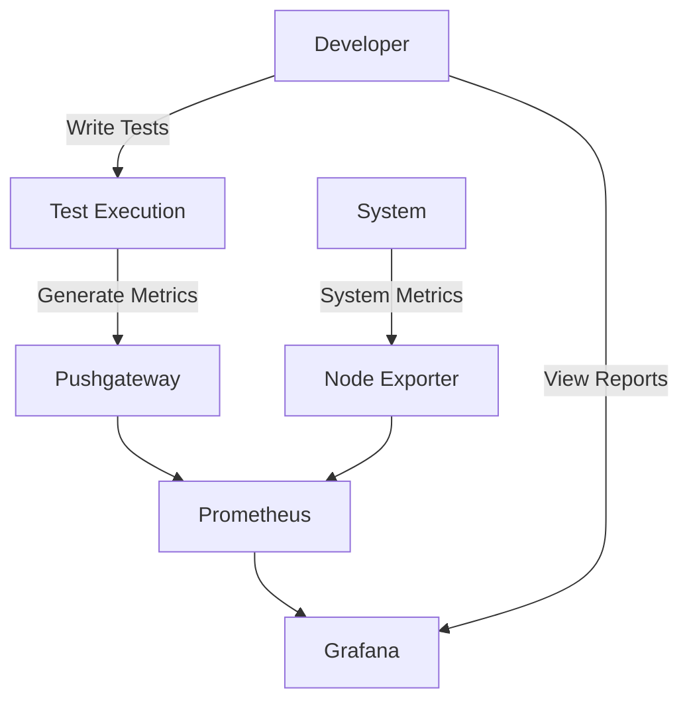

# ParaBank UI Automation - Complete Guide

## 📖 Table of Contents
1. [Project Overview](#-project-overview)
2. [Project Structure](#-project-structure)
3. [Prerequisites](#-prerequisites)
4. [Setup & Installation](#-setup--installation)
5. [Development Workflow](#-development-workflow)
6. [Testing](#-testing)
7. [Monitoring & Reporting](#-monitoring--reporting)
8. [CI/CD Integration](#-cicd-integration)
9. [Code Quality](#-code-quality)
10. [Troubleshooting](#-troubleshooting)

## 🏗️ Project Overview

ParaBank UI Automation is a robust testing framework designed for automated UI testing of the ParaBank application. It leverages modern tools and best practices to ensure reliable and maintainable test automation.

## 🏛️ Project Architecture

### Core Components

1. **Test Framework**
   - Built on **Playwright** for cross-browser testing
   - Uses **Pytest** as the test runner
   - Implements **Page Object Model (POM)** for maintainable test code

2. **Monitoring Stack**
   - **Prometheus**: Metrics collection and storage
   - **Grafana**: Visualization and dashboards
   - **Pushgateway**: Temporary metrics storage for batch jobs
   - **Node Exporter**: System metrics collection

3. **CI/CD Pipeline**
   - GitHub Actions for automated testing
   - Automated reporting and notifications
   - Containerized test execution

### Data Flow



### Key Design Patterns

1. **Page Object Model (POM)**
   - Each page has its own class
   - Encapsulates page elements and actions
   - Improves test maintainability

2. **Factory Pattern**
   - Used for browser instantiation
   - Supports multiple browser types

3. **Singleton Pattern**
   - Applied to browser context
   - Ensures single browser instance across tests

## 🔍 Monitoring Architecture

### Components

1. **Metrics Collection**
   - **Playwright Metrics**: Test execution times, pass/fail rates
   - **System Metrics**: CPU, memory, network usage
   - **Custom Metrics**: Business-specific test metrics

2. **Storage & Visualization**
   - **Prometheus**: Time-series database for metrics
   - **Grafana**: Custom dashboards for visualization

3. **Alerting**
   - Grafana alerts for test failures
   - Threshold-based notifications

### Integration Points

1. **Test Framework**
   - Sends metrics via Prometheus client
   - Pushes test results to Pushgateway

2. **Infrastructure**
   - Docker containers for all services
   - Network configuration for inter-service communication

3. **CI/CD**
   - Test results integrated into pipeline
   - Automated performance regression detection

## 📁 Project Structure

```
parabank-ui-automation/
├── .github/               # GitHub Actions workflows
│   └── workflows/         # CI/CD pipeline definitions
├── config/                # Configuration files
│   └── pytest.ini         # Pytest configuration
├── docs/                  # Documentation
├── reports/               # Test reports and screenshots
├── scripts/               # Development and utility scripts
│   ├── cleanup.sh         # Clean up test artifacts
│   ├── format.sh          # Code formatting script
│   ├── lint.sh            # Linting and code quality
│   └── typecheck.sh       # Static type checking
├── src/                   # Source code
│   ├── pages/             # Page Object Models
│   │   ├── base_page.py   # Base page class
│   │   ├── login_page.py  # Login page interactions
│   │   └── ...            # Other page objects
│   └── utils/             # Helper functions
│       ├── helpers.py     # Common utilities
│       └── monitoring.py  # Monitoring setup and management
├── tests/                 # Test cases
│   ├── test_login.py      # Login tests
│   ├── test_bill_pay.py   # Bill payment tests
│   └── conftest.py        # Pytest fixtures
├── .env.example          # Example environment variables
├── .gitignore            # Git ignore file
├── .pre-commit-config.yaml# Pre-commit hooks configuration
├── docker-compose.yml    # Docker Compose configuration
├── pyproject.toml        # Project configuration and dependencies
├── README.md            # Project documentation
└── requirements.txt      # Python dependencies
```

## 🧰 Prerequisites

- Python 3.10+
- Docker & Docker Compose
- Node.js (for Playwright)
- Git

## 🚀 Setup & Installation

### 1. Clone the Repository
```bash
git clone https://github.com/kunaal-ai/para-bank-ui-automation.git
cd para-bank-ui-automation
```

### 2. Set Up Python Environment
```bash
# Create and activate virtual environment
python -m venv .venv
source .venv/bin/activate  # On Windows: .venv\Scripts\activate

# Install dependencies
pip install -e ".[dev]"

# Install Playwright browsers
playwright install
```

### 3. Configure Environment Variables

The project supports multiple environments (dev, stage, prod) using JSON configuration files.

#### Setting Up Environment Configuration

1. **Copy the example configuration file for your environment:**
   ```bash
   # For development environment
   cp config/dev.json.example config/dev.json

   # For staging environment
   cp config/stage.json.example config/stage.json

   # For production environment
   cp config/prod.json.example config/prod.json
   ```

2. **Edit the configuration file with your environment-specific values:**
   ```json
   {
     "base_url": "https://parabank.parasoft.com/parabank",
     "api_url": "https://parabank.parasoft.com/parabank/api",
     "browser": "chromium",
     "headless": true,
     "timeout": 30000,
     "users": {
       "valid": {
         "username": "your_username",
         "password": "your_password"
       },
       "invalid": {
         "username": "invalid",
         "password": "invalid"
       }
     }
   }
   ```

#### Configuration File Structure

Each environment configuration file contains:
- **base_url**: Base URL of the ParaBank application
- **api_url**: API endpoint URL
- **browser**: Browser to use (`chromium`, `firefox`, or `webkit`)
- **headless**: Run browser in headless mode (`true`/`false`)
- **timeout**: Default timeout in milliseconds
- **users**: Test user credentials
  - **valid**: Valid user credentials for positive tests
  - **invalid**: Invalid credentials for negative tests

#### Legacy .env Configuration (Optional)

For backward compatibility, you can also use a `.env` file:
```bash
# Copy example environment file
cp .env.example .env

# Edit the .env file with your configuration
# (Update URLs, credentials, etc.)
```

## 🛠️ Development Workflow

### Code Formatting
```bash
# Auto-format code
./scripts/format.sh

# Or manually
black .
isort .
```

### Linting & Type Checking
```bash
# Run all linters
./scripts/lint.sh

# Run type checking
./scripts/typecheck.sh
```

### Pre-commit Hooks

Pre-commit hooks automatically format and check your code before each commit. This ensures code quality and consistency across the project.

#### Installation

```bash
# Install pre-commit hooks (run once after cloning)
pre-commit install

# Install hooks for commit messages (optional)
pre-commit install --hook-type commit-msg
```

#### Running Pre-commit Hooks

```bash
# Run hooks on all files (useful for CI/CD or manual checks)
pre-commit run --all-files

# Run hooks only on staged files (automatic on commit)
pre-commit run

# Run a specific hook
pre-commit run black --all-files
pre-commit run flake8 --all-files
pre-commit run mypy --all-files
```

#### Configured Hooks

The project includes comprehensive pre-commit hooks:

1. **Basic Checks**
   - `trailing-whitespace`: Removes trailing whitespace
   - `end-of-file-fixer`: Ensures files end with a newline
   - `check-yaml`: Validates YAML files
   - `check-json`: Validates JSON files
   - `check-toml`: Validates TOML files
   - `check-added-large-files`: Prevents committing large files
   - `check-merge-conflict`: Detects merge conflict markers
   - `check-case-conflict`: Detects case conflicts in filenames

2. **Code Formatting**
   - `black`: Automatic code formatting (Python, line length: 100)
   - `isort`: Import sorting with black profile

3. **Code Quality**
   - `flake8`: Linting with bugbear plugin (max line length: 100)
   - `pylint`: Advanced linting with custom configuration
   - `mypy`: Static type checking (excludes tests directory)
   - `bandit`: Security linting (excludes tests and venv)
   - `pip-audit`: Dependency vulnerability scanning

#### Bypassing Pre-commit Hooks

If you need to bypass pre-commit hooks (not recommended):

```bash
# Skip hooks for a single commit
git commit --no-verify -m "Emergency fix"
```

#### Troubleshooting Pre-commit

```bash
# Update pre-commit hooks to latest versions
pre-commit autoupdate

# Clear pre-commit cache if issues occur
pre-commit clean

# Run hooks with verbose output
pre-commit run --all-files --verbose
```

## 🧪 Testing

### Run All Tests
```bash
# Run all tests (uses dev environment by default)
pytest

# Run tests against specific environment
pytest --env=dev
pytest --env=stage
pytest --env=prod
```

### Run Specific Tests
```bash
# Run tests in parallel (4 workers)
pytest -n 4

# Run specific test file
pytest tests/test_login.py

# Run tests with browser UI (headed mode)
pytest --headed

# Run tests with specific browser
pytest --browser=firefox
pytest --browser=webkit

# Run tests with headless mode
pytest --headless

# Run specific test with verbose output
pytest tests/test_login.py -v

# Run tests with detailed logging
pytest --log-cli-level=DEBUG
```

### Using Environment Configuration in Tests

```python
def test_example(env_config):
    """Test using environment configuration."""
    # Access configuration as attributes
    base_url = env_config.base_url
    browser = env_config.browser
    timeout = env_config.timeout

    # Access user credentials
    username = env_config.users["valid"]["username"]
    password = env_config.users["valid"]["password"]

    # Use in test
    page.goto(base_url)
    page.fill("input[name='username']", username)
    page.fill("input[name='password']", password)
```

### Generate Reports
```bash
# HTML report
pytest --html=reports/report.html

# Coverage report
pytest --cov=src --cov-report=html

# Allure reports
pytest --alluredir=allure-results
allure serve allure-results
```

## 📊 Monitoring & Reporting

### Start Monitoring Stack
```bash
# Start all monitoring services (Prometheus, Grafana, etc.)
python -m src.utils.monitoring start

# Or use Docker Compose directly
docker compose up -d

# Check status of services
python -m src.utils.monitoring status

# Check if Docker is installed
python -m src.utils.monitoring check-docker
```

### Access Dashboards
- **Grafana**: http://localhost:3000 (admin/admin)
- **Prometheus**: http://localhost:9090
- **Jenkins**: http://localhost:8080

### Stop Monitoring
```bash
python -m src.utils.monitoring stop
# or
docker compose down
```

## 📝 Centralized Logging

The project includes a centralized logging system that automatically logs test execution to both console and file.

### Features

- **Automatic Setup**: Logger is automatically configured when tests run
- **Dual Output**: Logs to both console (stdout) and file (`logs/test_run.log`)
- **Structured Format**: Consistent log format with timestamps
- **Test Lifecycle Logging**: Automatically logs test start, completion, and failures

### Usage

```python
import logging

# Get the centralized logger
logger = logging.getLogger("parabank")

def test_example():
    logger.info("Starting test")
    try:
        # Test code
        logger.debug("Debug information")
        logger.info("Test step completed")
    except Exception as e:
        logger.error(f"Test failed: {e}", exc_info=True)
        raise
    finally:
        logger.info("Test completed")
```

### Log Levels

- **DEBUG**: Detailed debugging information
- **INFO**: General test progress and important events
- **WARNING**: Non-critical issues
- **ERROR**: Test failures and exceptions
- **CRITICAL**: Critical errors

### Configuration

- **Log File**: `logs/test_run.log` (created automatically)
- **Format**: `%(asctime)s - %(name)s - %(levelname)s - %(message)s`
- **Date Format**: `%Y-%m-%d %H:%M:%S`
- **Level**: `DEBUG` (captures all log levels)

### Custom Logger Setup

```python
from src.utils.logger import setup_logger
from pathlib import Path

# Create a custom logger
custom_logger = setup_logger(
    name="custom_module",
    log_level="INFO",
    log_file=Path("logs/custom.log")
)
```

## 📈 Test Metrics & Monitoring

The project includes comprehensive test metrics collection and monitoring capabilities.

### Metrics Collection

Test metrics are automatically collected during test execution:
- **Test Runs**: Total number of test executions
- **Test Passes**: Number of passed tests
- **Test Failures**: Number of failed tests
- **Test Duration**: Execution time for each test
- **Memory Usage**: Memory consumption during test execution
- **Performance Score**: Calculated performance metric (0-100)

### Using TestMetrics Context Manager

```python
from src.utils.metrics_pusher import TestMetrics

def test_example():
    with TestMetrics(test_name="test_example"):
        # Your test code here
        pass
    # Metrics are automatically pushed when context exits
```

### Manual Metrics Push

```python
from src.utils.metrics_pusher import push_metrics

# Push metrics manually
push_metrics(job_name="custom-job-name")
```

### Viewing Metrics

1. **Prometheus UI**: http://localhost:9090
   - Query: `test_runs_total`
   - Query: `test_passes_total`
   - Query: `test_failures_total`
   - Query: `test_duration_seconds`

2. **Grafana Dashboards**: http://localhost:3000
   - Pre-configured dashboards in `config/grafana/provisioning/dashboards/`
   - Custom queries and visualizations

## 🔄 CI/CD Integration

The project includes GitHub Actions workflows for continuous integration:

1. **CI Pipeline** (`.github/workflows/ci.yml`):
   - Runs on push and pull requests
   - Checks code formatting
   - Runs linting and type checking
   - Executes tests
   - Generates test reports

2. **CD Pipeline** (`.github/workflows/cd.yml`):
   - Deploys documentation
   - Publishes packages (if applicable)
   - Handles releases

## 🧹 Clean Up

To clean up test artifacts and temporary files:

```bash
# Using Python script (interactive)
python scripts/cleanup.py

# Using shell script
./scripts/cleanup.sh
```

The cleanup script removes:
- Python cache files (`__pycache__`, `*.pyc`)
- Pytest cache (`.pytest_cache`)
- Coverage files (`.coverage`, `coverage.xml`, `htmlcov/`)
- Build artifacts (`build/`, `dist/`, `*.egg-info/`)
- Virtual environments (`venv/`, `.venv`)
- IDE files (`.mypy_cache/`, `.tox/`)

## 🔒 Security

The project includes multiple security scanning tools:

### Security Tools

1. **Bandit** - Security linter for Python code
   - Scans for common security issues
   - Configured in `.bandit.yaml`
   - Runs in pre-commit hooks and Jenkins pipeline

2. **pip-audit** - Dependency vulnerability scanner
   - Scans `requirements.txt` for known vulnerabilities
   - Checks against Python vulnerability databases

### Running Security Checks

```bash
# Run bandit security scan
bandit -r src/ -f json -o bandit-report.json

# Run pip-audit
pip-audit --requirement requirements.txt

# Or use pre-commit
pre-commit run bandit --all-files
pre-commit run pip-audit --all-files
```

## 🐛 Troubleshooting

### Common Issues

1. **Docker not running**
   ```bash
   # Check Docker status
   docker info

   # Start Docker Desktop
   open -a Docker  # macOS
   # or
   systemctl start docker  # Linux

   # Check if Docker is installed
   python -m src.utils.monitoring check-docker
   ```

2. **Python dependencies not found**
   ```bash
   # Ensure virtual environment is activated
   source .venv/bin/activate

   # Reinstall dependencies
   pip install -e ".[dev]"
   ```

3. **Browser not found**
   ```bash
   # Install Playwright browsers
   playwright install
   ```

4. **Configuration file not found**
   ```bash
   # Copy example configuration file
   cp config/dev.json.example config/dev.json

   # Edit with your values
   nano config/dev.json  # or use your preferred editor
   ```

5. **Pre-commit hooks failing**
   ```bash
   # Update pre-commit hooks
   pre-commit autoupdate

   # Clear cache
   pre-commit clean

   # Run with verbose output
   pre-commit run --all-files --verbose
   ```

6. **Logs not appearing**
   ```bash
   # Check if logs directory exists
   ls -la logs/

   # Check log file permissions
   chmod 644 logs/test_run.log

   # View logs in real-time
   tail -f logs/test_run.log
   ```

7. **Metrics not appearing in Prometheus**
   ```bash
   # Check if Pushgateway is running
   docker ps | grep pushgateway

   # Check Pushgateway logs
   docker logs pushgateway

   # Verify Pushgateway is accessible
   curl http://localhost:9091
   ```

## 📚 Additional Resources

- [Playwright Documentation](https://playwright.dev/python/)
- [Pytest Documentation](https://docs.pytest.org/)
- [Docker Documentation](https://docs.docker.com/)
- [Grafana Documentation](https://grafana.com/docs/)
- [Pre-commit Documentation](https://pre-commit.com/)
- [Black Code Formatter](https://black.readthedocs.io/)
- [mypy Type Checker](https://mypy.readthedocs.io/)
- [Prometheus Documentation](https://prometheus.io/docs/)

## 🎯 Best Practices

### Code Quality
- Always run pre-commit hooks before committing
- Use type hints for better code maintainability
- Follow PEP 8 style guidelines (enforced by Black)
- Write descriptive test names and docstrings

### Testing
- Use environment-specific configurations for different test environments
- Leverage the centralized logger for debugging
- Use TestMetrics context manager for metrics collection
- Keep tests independent and isolated

### Configuration
- Never commit actual credentials to version control
- Use `.example` files as templates
- Keep environment-specific configurations separate
- Document any custom configuration changes

### Monitoring
- Start monitoring stack before running tests for metrics collection
- Regularly check Grafana dashboards for test trends
- Use Prometheus queries to analyze test performance
- Set up alerts for test failure thresholds
